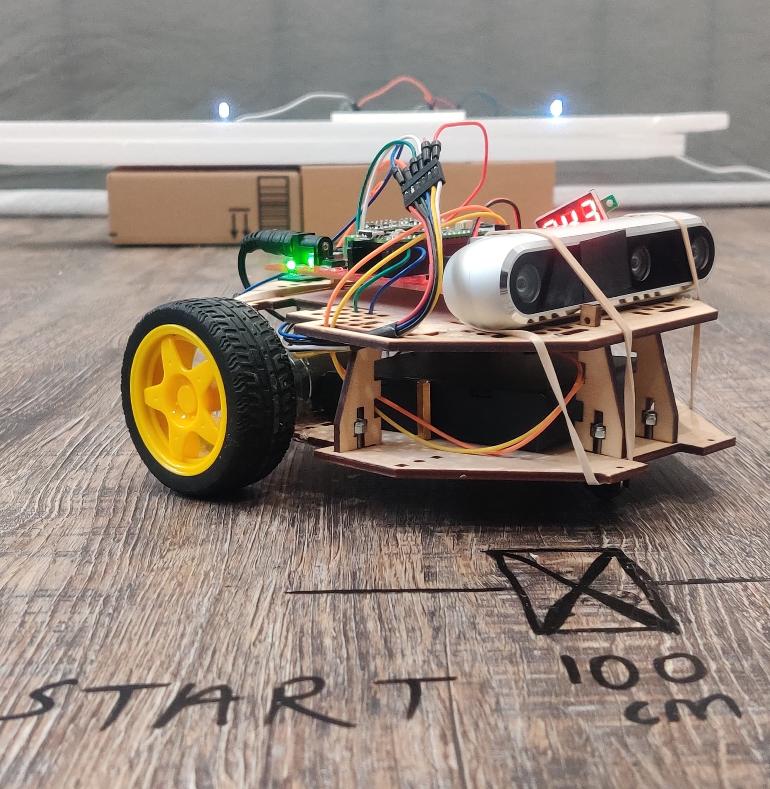
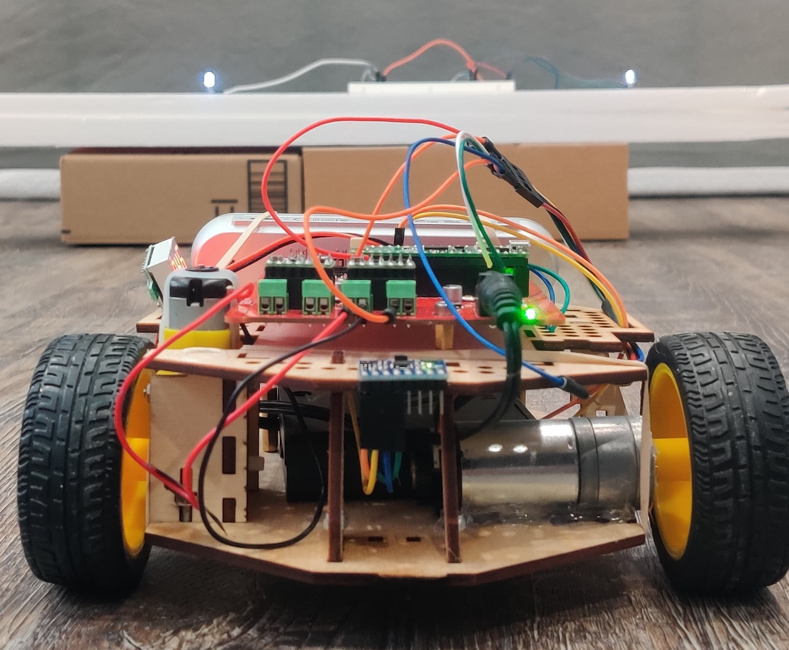
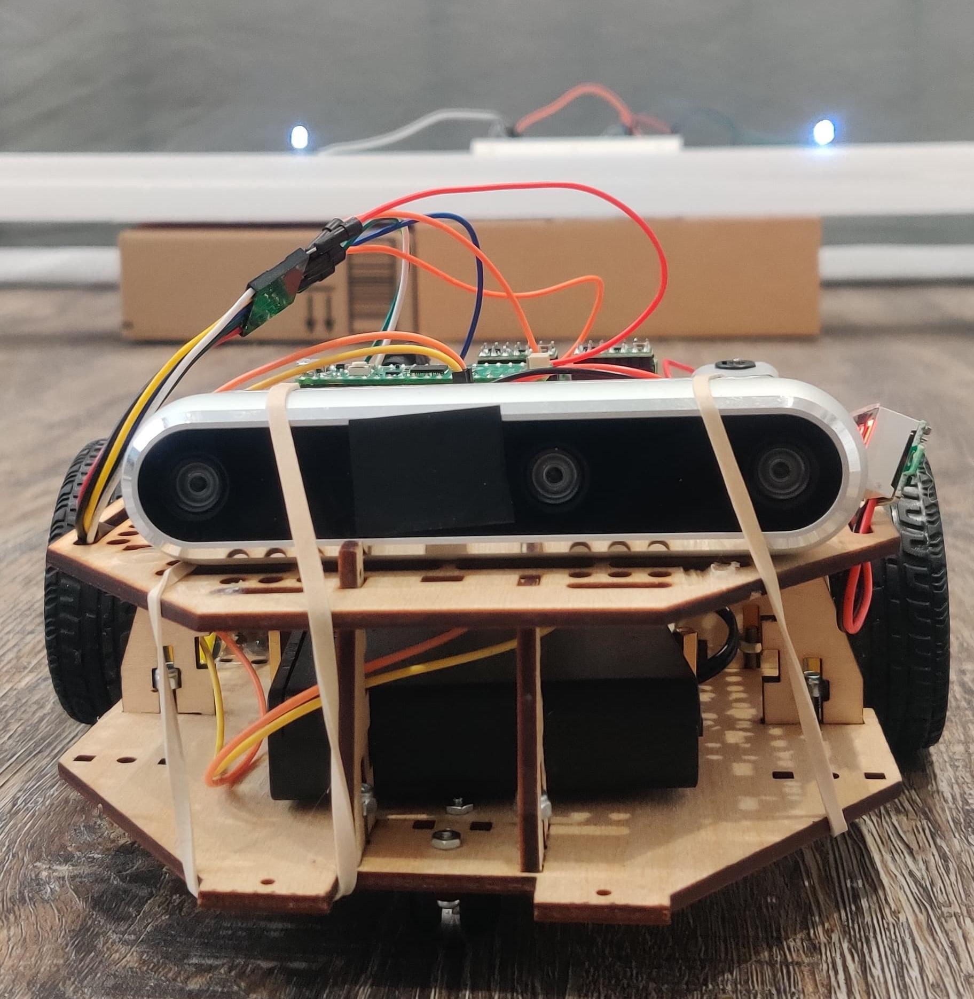
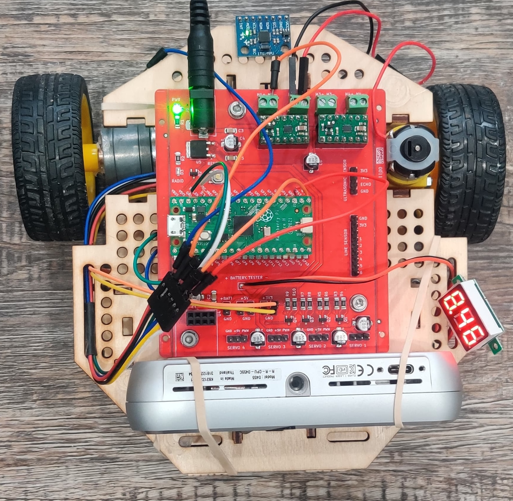
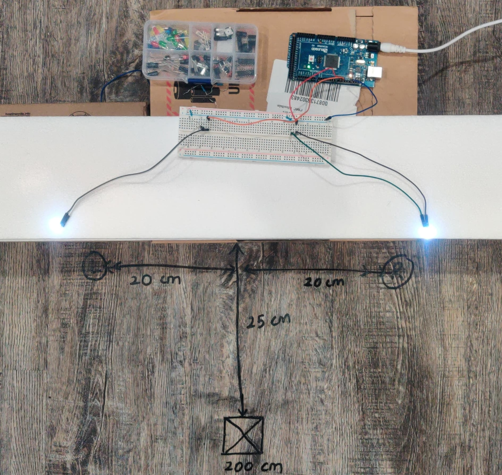
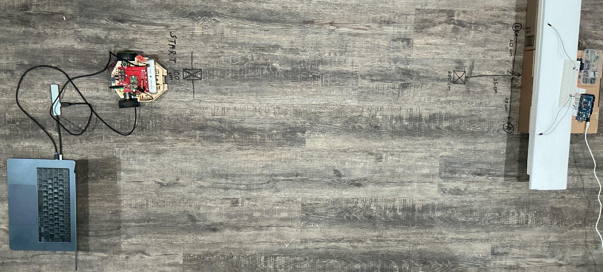

# Robot Localization using Software Lock-In Visible Light Positioning (VLP) and Extended Kalman Filter (EKF) Sensor Fusion

This project addresses a common problem in low-cost robotics: **Odometry Drift**. 

Cheap motors and encoders lose accuracy over time—wheels slip, sensors drift, and errors accumulate. To fix this without using expensive LIDAR or GPS (which doesn't work indoors), I built a system that uses  LED lights (beacons) as "artificial stars" to correct the robot's position.

## ⚙️ The Hardware
The robot is a differential drive chassis modified for this project.
* **Controller:** Raspberry Pi Pico (Motor control & IMU polling) + Laptop (Computer Vision & EKF).
* **Sensors:** RealSense D455 (RGB only), MPU-6050 Gyroscope, Magnetic Wheel Encoders.
* **Beacons:** Standard 5mm LEDs modulation at **14.1 Hz**.

<p align="center">
  
  
  <br>
  <em>Left: Robot platform with RealSense D455 camera and frequency-
    modulated beacons behind. Right: Chassis featuring geared DC motor(left) and geared DC motor with
  magnetic quadrature encoder(right).</em>

<p align="center">
  
  
  <br>
  <em>Left: The modified chassis with inverted camera mount. Right: Top view showing the wiring and MCU.</em>
</p>

## 💡 Beacon Setup
The "Software Lock-in" algorithm allows standard cameras to detect these beacons even in a bright room. The LEDs blink at a specific frequency (14.1 Hz), and the code uses FFT (Fast Fourier Transform) to isolate that specific frequency from background noise.

<p align="center">
  
  <br>
  <em>The testbed setup: Two LED beacons placed 0.4m apart serve as the absolute reference.</em>
</p>
<p align="center">
  
  <br>
  <em>The testbed setup: Robot placed at 1.25m away from the beacons.</em>
</p>

---

## 📊 Results Summary
We ran the robot through four distinct trajectory experiments to see if the Vision System (VLP) could fix the drift from the Encoders (Odometry). 

**The exact results from the final report:**

| Experiment | Odom Error (Drift) | Fused Error (Corrected) | Reduction |
| :--- | :--- | :--- | :--- |
| **1. Straight + Lateral + Backward** | 6.4 cm | 2.0 cm | **69%** |
| **2. Leftward + Lateral + Backward** | 8.1 cm | 4.2 cm | **48%** |
| **3. Loop Closure (Circle)** | 13.1 cm | 4.6 cm | **65%** |
| **4. Multi-Turn Complex Path** | 9.9 cm | 6.7 cm | **33%** |
| **AVERAGE** | **9.4 cm** | **4.4 cm** | **53.8%** |

[cite_start][cite: 262]

---

## 🎥 Demonstrations
For high-quality video demonstrations of the experiments, including side-by-side views of the robot's physical movement and its internal state estimation, please visit the link below:

### [📂 View Full Video Demonstrations (Google Drive)](https://drive.google.com/drive/folders/1nec2ivryCiP0fwHjrSjUP5Z5dE_Eebhr?usp=sharing)

---

## 💻 How to Run
The system uses a **Host-Client architecture**.

### 1. Hardware Setup
* **Embedded:** Upload `main.py` to the Raspberry Pi Pico (using Thonny).
* **Beacons:** Upload `beacon_driver.ino` to the Arduino.

### 2. Calibration (Crucial Step)
Before running the main robot, you must identify the beacon pixel coordinates for your specific starting position.
1.  Place the robot at the origin (0,0).
2.  Run the calibration tool:
    ```bash
    python3 beacons_pixel_extractor.py
    ```
3.  Wait for the green/red circles to stabilize on the beacons.
4.  Press **'Y'** to lock. The terminal will print: `LOCKED: Left_X=251, Right_X=371`.
5.  **Update `final_robot.py`**: Open the main script and replace `CALIB_PIXEL_L` and `CALIB_PIXEL_R` with these new values.

### 3. Execution
Connect the Robot via USB and run the sensor fusion engine:
```bash
python3 final_robot.py
```
*See the [source code folder](/code).*
### 4. More Information?
Detailed report is available in the project folder.

